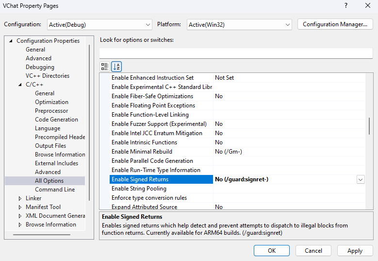
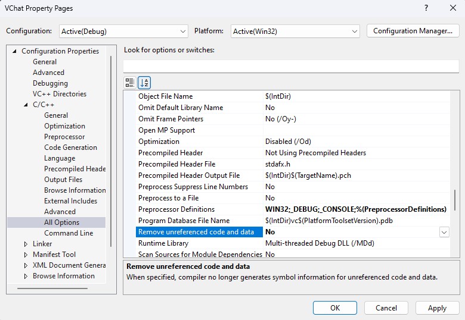

# EXE Configuration and Building
0. Download Visual Studio
0. Open Visual Studio 
1. Create a Empty `C++` Console project

    

2. Set the project to be a 32-bit x86 executable
   1. Open the configuration manager from the **Build** tab

        

    2. Select Win32 for a `X86` program in both the platform and Active Solution Platform 

        

3. Configure the Project's C++ compiler options (It compiles the C too!)
   1. Disable Control Flow Guard

        

    2. Set the Excepton Hander used to be SEH

        

    3. Set EH Continuation Metadata to No

        

    4. Disable Signed Returns 

        

    5. Disable  *Remove Unreferenced Code and Data*

        
    
    6. Disable SDL checks 

        
    
    7. Disable Security Checks 

        

    8. Disable the Debug Information 

        

    9. Disable Support Just My Code Debugging 

        

    10. Make sure we do not validate stack frames 

        

    11. Change the Runtime Library to Multi-Threaded DLL (No longer Debug)

        

4. Modify the Linker settings in the properties page
   1. Disable Randomized Base Address 

        
   
   2. Set References to `/OPT:NOREF`

        
   
   3. Ensure the target machine is x86!

        

   4. Disable DEP

        
   
   5. Disable SAFE SEH

        

5. Once you have generated the DLL configure the project to look for the `.a` file at a specified path.
   1. In `Linker -> Input -> Additional Dependencies` add *libessfunc.a* as one of the additional dependencies.

        

   2. In `Linker -> General -> Additional Library Directories` add the paths we can search for the *libessfunc.a* file in.

        

6. Build the project!
7. For the project to run you will need to copy the DLL over to the same directory as the EXE. If you make modifications to the DLL you will need to copy it over too.